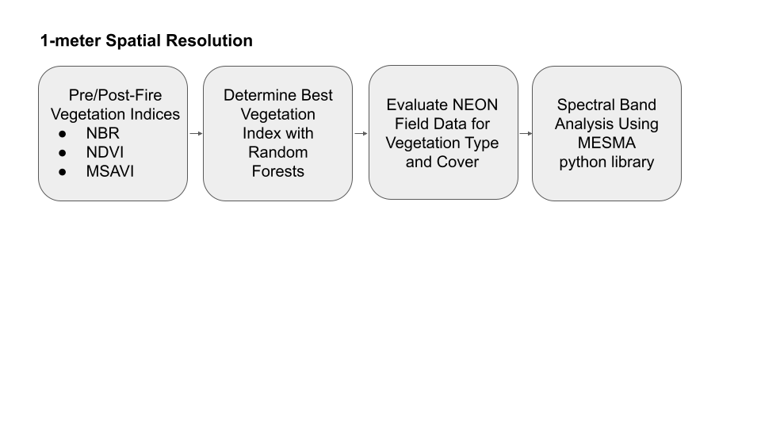

# Post-Wildfire Recovery
This is a collaborative [Earth Lab](earthlab.colorado.edu) Applications project by [Eric Gottlieb](https://github.com/esgeo) and [Heidi Yoon](https://github.com/AreteY) studying post-wildfire recovery.

# Purpose
In this project, we explore the post-wildfire recovery for the [2016 Chimney Tops 2 Fire](https://www.nps.gov/grsm/learn/chimney-tops-2-fire.htm) by spatially quantifying the vegetation recovery using hyperspectral reflectance data and by XXX. This project highlights how high, spatial-resolution (1-meter) remote sensing measurements, such as LiDAR topography and hyperspectral reflectance data, can be used to study fire recovery on the order of the spatial variation on the ground. In this repository, we include example code that processes and analyzes hyperspectral reflectance data to assess the post-wildfire recovery with vegetation indices (/Notebooks/vegetation_indices.ipynb).

For more background about our project, please see our blog post and its figures in the Reports folder (post_wildfire_blog_gottlieb_yoon.ipynb or html) and the Graphics folder (blog figures 1-3 and ig-raws.png, ig-raws-rose.png, ig-raws-rose-gust.png), respectively.

# Project Environment
To install and run the python environment for this project, please use the instructions below.
## Installing and Running the Environment
1. Change your directory to `earth-analytics`.
2. Download the file `neon-environment.yml`, which contains instructions on how to install the environment, into this directory.
3. Create the environment by running: `conda env create -f neon-environment.yml`.
4. Once the environment is installed, activate it by running: `conda activate earth-analytics-neon`.
# Tools and Packages Used
* os
* matplotlib
* numpy
* requests
* h5py
* geopandas
* earthpy
* folium
# Data Sources
Raster data
1. NEON LiDAR Ecosystem Structure (https://data.neonscience.org/data-products/DP3.30015.001)
* **Reference**: National Ecological Observatory Network. 2022. Data Product DP3.30015.001, Ecosystem structure. Provisional data downloaded from https://data.neonscience.org on March 31, 2022. Battelle, Boulder, CO, USA NEON. 2022.
2. NEON Spectrometer Reflectance (https://data.neonscience.org/data-products/DP1.30006.001)
* **Reference:** National Ecological Observatory Network. Spectrometer orthorectified surface directional reflectance - mosaic (DP3.30006.001), RELEASE-2022. https://doi.org/10.48443/5er3-8n49. Dataset accessed from https://data.neonscience.org on April 15, 2022
3. NEON LiDAR Elevation Digital Terrain Model (https://data.neonscience.org/data-products/DP3.30024.001)  
* **Reference:** National Ecological Observatory Network. Elevation - LiDAR (DP3.30024.001), RELEASE-2022. https://doi.org/10.48443/ymmp-fr93. Dataset accessed from https://data.neonscience.org on April 18, 2022
4. LandFire Biophysical Setting and Vegetation Departure Grids.  (https://landfire.gov/index.php)
* **Reference:** LANDFIRE: LANDFIRE Remap 2016 Biophysical Settings (BPS) CONUS layer.(2020, October - last update). U.S. Department of Interior, Geological Survey, and U.S. Department of Agriculture. Available:https://landfire.gov/bps.php. Data accessed April 3, 2022.
* **Reference:** LANDFIRE: LANDFIRE Remap 2016 Vegetation Departure grid (VDEP) CONUS layer.(2020, October - last update). U.S. Department of Interior, Geological Survey, and U.S. Department of Agriculture. Available:https://landfire.gov/vdep.php. Data accessed April 3, 2022.

Vector data
5. Chimney Tops 2 Fire Perimeter
* **Reference:** MTBS Data Access: Fire Level Geospatial Data. (2022, February - last revised). MTBS Project (USDA Forest Service/U.S. Geological Survey). Available:http://mtbs.gov/direct-download. Data accessed April 3, 2022.
* Available for download in this repository as Release v1.0.0 fire-boundary
6. Great Smoky Mountains National Park Perimeter
* **Reference:** National Park Service- Land Resources Division. Great Smoky Mountains National Park Boundary. (December 30, 2019 - last revised). Available: https://grsm-nps.opendata.arcgis.com. Data accessed March 28, 2022.
* Available for download in this repository as Release v1.0.1 grsm-boundary

Time-series data
7. Remote Automated Weather Station (RAWS) data for Indian Grave RAWS Site (https://raws.dri.edu/cgi-bin/rawMAIN.pl?laTIND).
* **Reference:** Indian Grave RAWS hourly data fof November 2016. U.S. Forest Service Fire and Aviation Management Information Technology Portal. 2022. FW13 hourly station data (station ID:407603). Downloaded from https://famit.nwcg.gov/applications/FAMWeb on April 16, 2022.

Tabular data
8. NEON Plant Presence and Percent Cover (https://data.neonscience.org/data-products/DP1.10058.001)
* **Reference:** NEON (National Ecological Observatory Network). Plant presence and percent cover (DP1.10058.001), RELEASE-2022. https://doi.org/10.48443/pr5e-1q60. Dataset accessed from https://data.neonscience.org on April 18, 2022.

# Project Workflow

# Example Usage

# License
