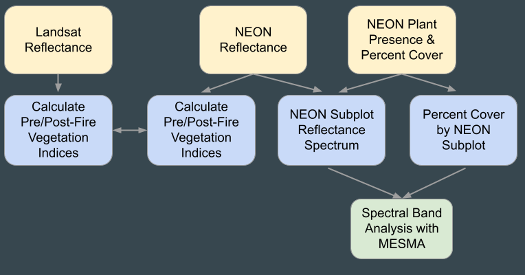

# ea-2022-post-wildfire-vegetation-change
Earth Lab Capstone Project: Post-Wildfire Vegetation Change

# Purpose
The Chimney Tops 2 Wildfire occurred from November 23 to November 28, 2016 in Great Smoky Mountains National Park and burned approximately 11,000 acres within the park. We are interested in exploring the post-fire vegetation recovery in Great Smoky Mountains National Park by assessing the vegetation type and structure along with burn severity to understand ecosystem recovery and risk assessment for future wildland fires. 
# Project Environment
We study the post-wildfire vegetation change for the Chimney Tops 2 Fire using a python environment. We run this environment in a directory called `earth-analytics`. To install and run the python environment for this project, please use the instructions below.
## Installing and Running the Environment
1. Change your directory to `earth-analytics`.
2. Download the file `neon-environment.yml`, which contains instructions on how to install the environment, into this directory. 
3. Create the environment by running: `conda env create -f neon-environment.yml`.
4. Once the environment is installed, activate it by running: `conda activate earth-analytics-neon`. 
# Data Sources
Raster data
1. NEON LiDAR Ecosystem Structure (https://data.neonscience.org/data-products/DP3.30015.001)
* **Reference**: National Ecological Observatory Network. 2022. Data Product DP3.30015.001, Ecosystem structure. Provisional data downloaded from https://data.neonscience.org on March 31, 2022. Battelle, Boulder, CO, USA NEON. 2022.
2. NEON Spectrometer Reflectance (https://data.neonscience.org/data-products/DP1.30006.001)
* **Reference:** National Ecological Observatory Network. 2022. Data Product DP3.30006.001, Spectrometer orthorectified surface directional reflectance - mosaic. Provisional data downloaded from https://data.neonscience.org on April 3, 2022. Battelle, Boulder, CO, USA NEON. 2022.
3. NEON LiDAR Elevation Digital Terrain Model (https://data.neonscience.org/data-products/DP3.30024.001)  
* **Reference:** National Ecological Observatory Network. Elevation - LiDAR (DP3.30024.001), RELEASE-2022. https://doi.org/10.48443/ymmp-fr93. Dataset accessed from https://data.neonscience.org on April 18, 2022
4. LandFire Biophyscial Setting and Vegetation Departure Grids.  (https://landfire.gov/index.php)
* **References:** LANDFIRE: LANDFIRE Remap 2016 Biophysical Settings (BPS) CONUS layer.(2020, October - last update). U.S. Department of Interior, Geological Survey, and U.S. Department of Agriculture. Available:https://landfire.gov/bps.php. Data accessed April 3, 2022.
LANDFIRE: LANDFIRE Remap 2016 Vegetation Departure grid (VDEP) CONUS layer.(2020, October - last update). U.S. Department of Interior, Geological Survey, and U.S. Department of Agriculture. Available:https://landfire.gov/vdep.php. Data accessed April 3, 2022.

Vector data
5. Chimney Tops 2 Fire Perimeter (https://www.mtbs.gov/direct-download)
* **Reference:** MTBS Data Access: Fire Level Geospatial Data. (2022, February - last revised). MTBS Project (USDA Forest Service/U.S. Geological Survey). Available:http://mtbs.gov/direct-download. Data accessed April 3, 2022.

Time-series data
6. Remote Automated Weather Station (RAWS) data for Indian Grave RAWS Site (https://raws.dri.edu/cgi-bin/rawMAIN.pl?laTIND).
* **Reference:** Indian Grave RAWS hourly data fof November 2016. U.S. Forest Service Fire and Aviation Management Information Technology Portal. 2022. FW13 hourly station data (station ID:407603). Downloaded from https://famit.nwcg.gov/applications/FAMWeb on April 16, 2022.

# Workflow

